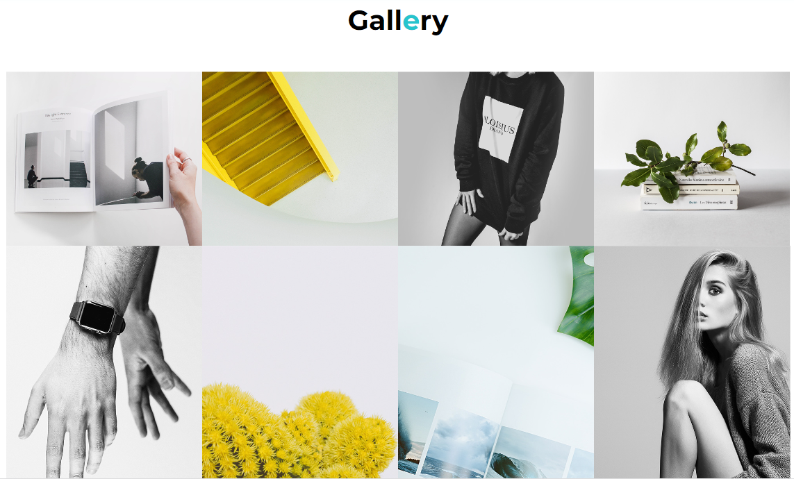

# Aleksandra Makarets - photographer

The central purpose is to showcase a photographer's best work. The website acts as a curated collection of images that demonstrate the photographer's skills, creativity, and the range of their capabilities.

 Aleksandra Makarets photographer's portfolio website is a platform for attracting potential clients, collaborators, or job opportunities.
 
 ## Features

### Existing Features

- __Navigation Bar__

  - Featured on the top of the page, the navigation shows the photographer's name in the left corner: A.Makarets that links to the top of the page.
  - The other navigation links are to the right: About, Servises, Gallery and Contact which link to different pages of the website.
  - This section will allow the user to easily navigate from page to page across all devices without having to revert back to the previous page via the ‘back’ button.
  
  
- __The landing page and image__
 - The main page shows the name of the photographer and a friendly introduction to the visitors of the site.
  - It contains the author's personal opinions about his site and two buttons "Hire me" and "View my works" are located so that the user can quickly find the necessary section when researching the site.
  - The photo of the photographer is placed on the right, so that visitors feel as if the photographer is next to them and is talking about himself. It is hidden on phone-sized screens.
  

- __Some numbers section__

  - The section some numbers allows visitors to see how much experience the photographer has at this time.
  - The section contains data on the number of photoshoots, how many models, locations and countries there were.
  - This section will be updated as the data changes to keep the user up to date.

- __Footer section__

  - The footer section includes links to the relevant social media sites for Aleksandra Makarets. The links will open to a new tab to allow easy navigation for the user.
  - The footer also contains a site navigation panel and the photographer's contact information.
  - The footer is valuable to the user as it encourages them to keep connected via social media.

- __About section__

  - In the About section, users can get to know the photographer better and understand why she does this work.

- __Servises section__

  - This is one of the most important pages of the website, here the user can learn about all types of services provided by the photographer.
  - Servises includes: portraits, creative, family memories, love story, fashion and street photo.
  - The services are immediately demonstrated on the photo of the photographer, so the user can see what a different kind of photo session means.
  

- __Offets and price section__

  - Package offers are clearly described here, which the client can choose when ordering an offer.
  - Website users are shown three packages: Minimum, Standard and Premium.
   They differ in price, number of photos and locations.
  - In order for the user to immediately choose a suitable package, there is a purchase button at the bottom.
  

- __Gallery section__

  - The gallery will provide the user with supporting images to see what the photoshoots look like.
  - This section is valuable to the user as he will be able to easily identify the types of photoshoots the photographer is doing.
  

- __Contact section__

  - In the "Contacts" section, the user can leave his data to contact him and discuss the photoshoot or answer questions.
  - The user will be asked to submit their full name and email address and phone number.
  - Users are also offered a text entry field where they can write their wishes or describe their dream photo shoot.
  - The page is decorated with an image of a camera, which perfectly emphasizes the minimalist style of this site.
  

### Features Left to Implement

- __Quick form of payment on the website through well-known payment systems of the world.__